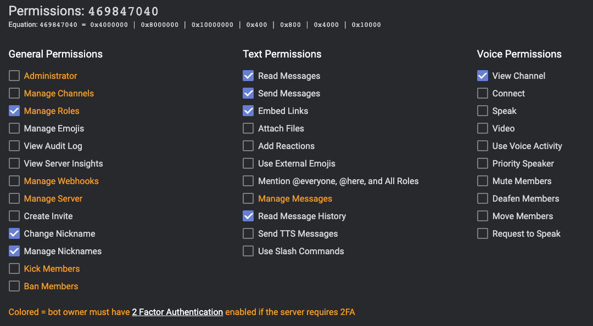

# AlbionOnline-RegisterBot

## Setting up

virtualenv -p python3 env

source env/bin/activate

pip install -r requeriments.txt

Create a .env like this:

```env

TOKEN=XXXXXXXXXXXXXXXX

```

## Invite link

Those will be the permissions that the bot will have


### Link

<https://discord.com/oauth2/authorize?client_id=INSERT_CLIENT_ID_HERE&scope=bot&permissions=2617338880>

## Executing the bot

pip install -r requeriments.txt

python main.py

## DONE

- Setup command
  - Ask
    - [X] Bot prefix
    - [X] Guild ID
    - [X] Alliance ID
    - [X] Guild Rol ID
    - [X] Alliance Rol ID
    - [X] Update sql insert to avoid duplicate rows
  - [X] Confirm values (Prefix, GuildName, GuildTag, AllianceName, AllianceTag, GuildRolName)
  - [X] Save values in Database
- Register command
  - [X] Check if user its already registered
  - [X] Add role
  - [X] Change nickname
  - [X] Store users in guild database
  - [X] Update sql SELECT to get data from GUILD instead of return every value and get first
  - [X] Check if user its on blacklist
- Blacklist
  - [X] blacklist command with reason
- Unblacklist
  - [X] unblacklist (Only for manage rol users)
  - [X] Register command
- UTC
  - [X] Print UTC hour
- General
  - [X] Command timeouts
  - [X] Unregister command
  - [X] Custom bot prefix
  - [X] Ignore DMs
  - [X] Split commands into files

- Database
  - [X] Create Database and table
  - [X] Clear guild in database on bot exist

### TODO First

- [ ] Fix alliance query on users table
- [ ] check command to see if blacklisted
- [ ] Clear blacklist table on guild exist

### TODO Later

- [ ] Improve/Reorder register checks remove from if/else to be more "modular"

- [ ] addGuild command
  - [ ] Add Guild to exit field (separator a ',')
- [ ] addAlliance command
  - [ ] Add Alliance to exit field (separator a ',')
- [ ] Register command
  - [ ] Check from all guilds/alliances (separator a ',')

- [ ] Send query to guild and save all members every X minutes, avoiding spamming the API
- [ ] Cleanup users every day if they arent on the guild or alliance and remove from database
- [ ] Auto-clean commands and users messages
