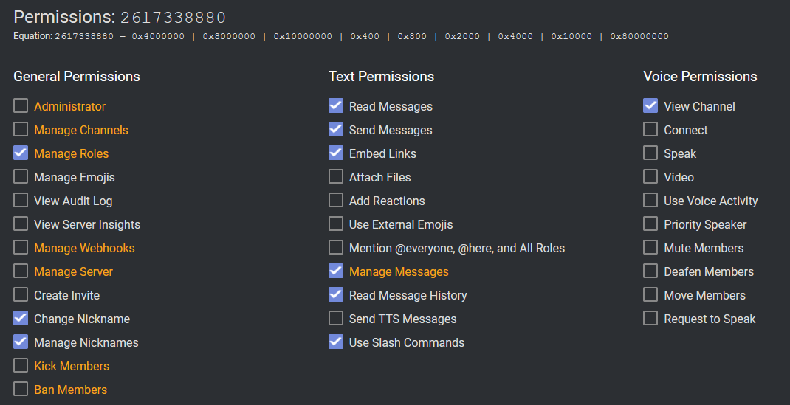

# AlbionOnline-RegisterBot

## Setting up

virtualenv -p python3 env
source env/bin/activate
pip install -r requeriments.txt
Create a .env like this:

```env

TOKEN=XXXXXXXXXXXXXXXX

```

## Invite link

Those will be the permissions that the bot will have


### Link

<https://discord.com/oauth2/authorize?client_id=INSERT_CLIENT_ID_HERE&scope=bot&permissions=2617338880>

## Executing the bot

python main.py

## TODO

- [X] Create Database and table (DONE)
- [ ] Custom bot prefix
- Setup command
  - Ask
    - [X] Bot prefix (DONE)
    - [X] Guild ID (DONE)
    - [X] Alliance ID (DONE)
    - [X] Guild Rol ID (DONE)
    - [X] Alliance Rol ID (DONE)
  - [X] Confirm values (Prefix, GuildName, GuildTag, AllianceName, AllianceTag, GuildRolName) (DONE)
  - [ ] Add multiples Guilds
  - [ ] Add multiples Alliances
  - [X] Save values in Database (DONE)
- Register command
  - [ ] Check if user its already registered
  - [X] Add role (DONE)
  - [X] Change nickname (DONE)
  - [ ] Store users in guild database
- [X] Command timeouts (DONE)
- [X] Auto-clean commands or whole channel

### TODO Later

- [ ] Blacklist command
- [ ] Cleanup of users if the arent any more on the guild or alliance
- [ ] Unregister command (Para usuarios)
- [ ] forceUnregister command (Unregister user, for users with manage roles permission)
- [ ] Send query to guild and save all members every X minutes, avoiding spamming the API
- [ ] Cleanup users every day, if they arent on the guild and remove from database
